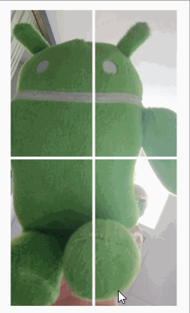

<h2>Demo Alternate Crop</h2>

This is the source project for the demo app shown in
[this answer](https://stackoverflow.com/a/54278884/6287910)  to
[this Stack Overflow question](https://stackoverflow.com/questions/54216273/how-to-have-similar-mechanism-of-center-crop-on-exoplayers-playerview-but-not).

<h4><u>Center Crop versus Off-center Crop</u></h4>

In this demo, the underlying JPEG is 1,080 pixels wide and 1,920 pixels high. The goal
of the demo app is to fit this image into an _ImageView_ with scaling and
cropping that is similar to
[ImageView.ScaleType.CENTER_CROP](https://developer.android.com/reference/android/widget/ImageView.ScaleType)
but with a focal point for the scaling and cropping that can be independently set as a
percentage from the top and left sides of the image.

Center crop has a focal point that is located at 1/2 the width and 1/2
the height of the image as shown below. White lines mark the vertical
and horizontal center lines. With a scale type of center crop, the image is always sized such that
the width and/or the height fits precisely within the _ImageView_. The
image will completely fill the view. As the image changes size, notice
how the image collapses around the center.

Now let's move to a focal point that is 20% of the image height from
the top of the image and 20% from the left edge. In the following
image, blue lines mark the new focus (here 20%/20%) on the image while
red lines mark the same point on the _ImageView_. As before, white lines
mark the centers.

As the _ImageView_ shrinks, the image collapses around the point that
is 20% from the top and 20% from the left side. The width and/or
height fits precisely within the _ImageView_ As with center crop, gaps
between the image and the _ImageView_ are not permitted. The percentage
can be anything from zero to 100 percent.

<h4><u>How the demo works</u></h4>

The demo's single activity hosts a single layout, _activity_main.xml_, that
uses _ConstraintLayout_.  Within this layout, two views, _horizontalLine_
and _verticalLine_ produce red lines that show the percentages for the
horizontal and vertical offsets within the _ImageView_.

A custom view, _MyImageView.java_, uses the biases of these two views
to draw a blue line on the bitmap for the image that defines the offsets.
The custom view also draws the white center lines.

 To change the percentage used, define different biases for the two
 _Views_ in the layout. The code will pick up these biases and make
 the necessary adjustments to accommodate these biases. See the use
 of _MyImageView#setFocalPoint()_ in the code.

 The image is scaled and cropped using a [Matrix](https://developer.android.com/reference/android/graphics/Matrix)
 applied through the _matrix_ scale type defined in the layout for
 the _ImageView_.  _MyImageView#prepareMatrix()_ does the necessary
 calculations.

 Movement is done with a touch listener in the main activity. Once movement
 starts, the dimension of movement (up/down, left/right) is locked in
 so the image can be made to grow or shrink in only one dimension at
 a time. This is to better show how the display changes.